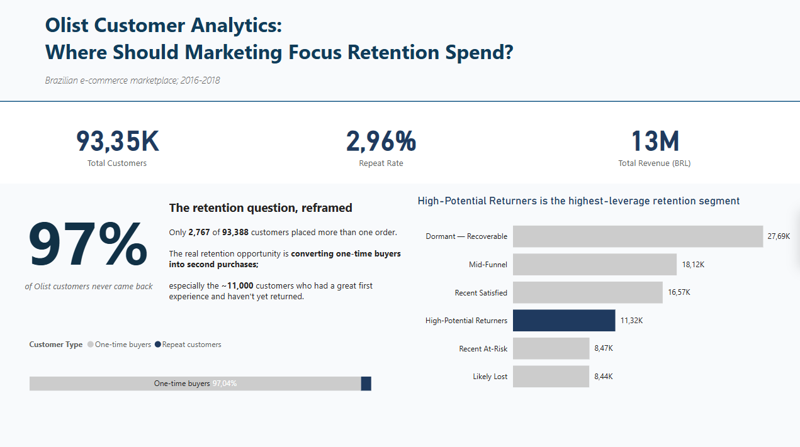
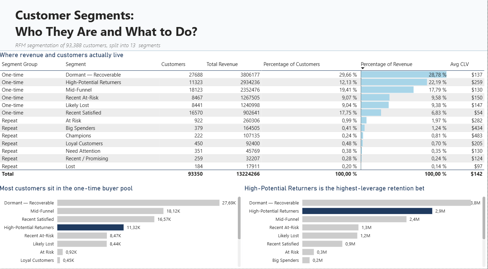
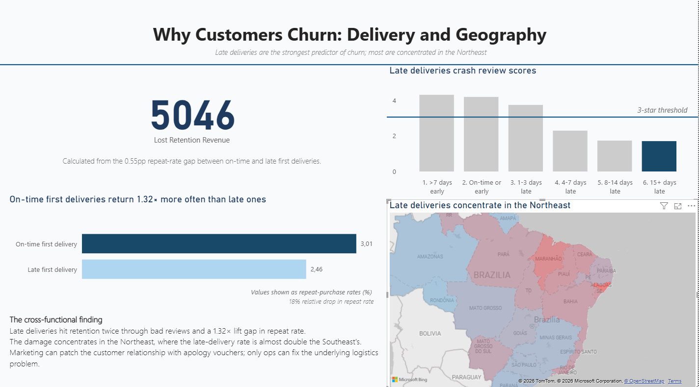
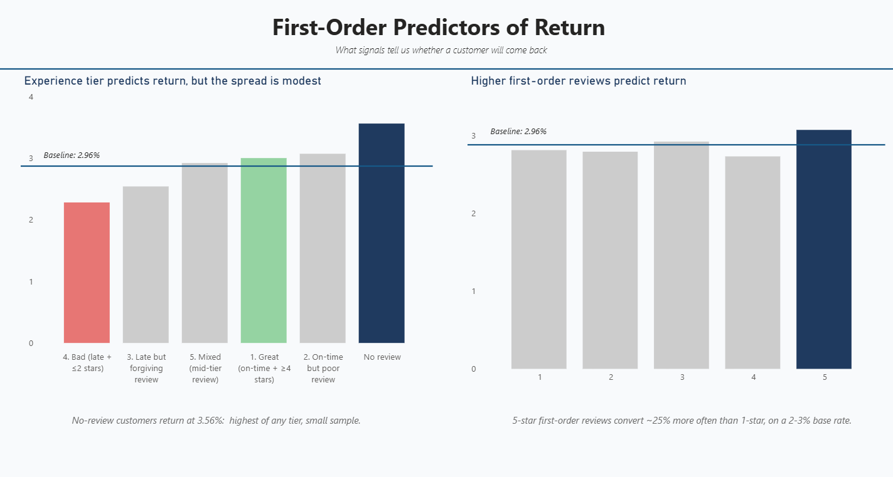

# Where Should Marketing Focus Retention Spend?
### An End-to-End Customer Analytics Project on the Olist Brazilian Marketplace

## Introduction

Olist is a Brazilian e-commerce platform connecting small sellers to large marketplaces. Between September 2016 and August 2018, it processed 100,000 orders from 93,000 customers across all 27 Brazilian states.

This case study seeks to answer the question: **where should its marketing team focus retention spend to maximize revenue?**

Before working with the data, my expectations were that the company retained a significant loyal customer base, with some at-risk and lost customers; a very ordinary e-commerce retention story. Once I started my analysis, I was shocked by the main finding:

**97% of Olist customers only placed one order.**

Olist lacks a meaningful loyal customer base. Its main goal is converting one-time buyers into a second purchase, not preventing churn.

To reach my conclusion, I cleaned 99K raw orders down to 96K delivered orders, built an RFM segmentation adapted for the one-time-buyer reality, identified the customer segments where retention spend has the highest leverage, and quantified the impact of two structural problems: delivery delays and regional logistics gaps in Brazil's Northeast.

Four research questions guided the analysis:

1. **Customer segmentation:** Which segments drive the most revenue, and how should marketing approach them?
2. **Delivery and reviews:** Does delivery performance and timing correlate with customer reviews and the probability of a second order?
3. **Geographic patterns:** Which areas of Brazil have the strongest retention possibilities?
4. **First-order signals:** What factors of a customer's first order influence their second purchase?

*Figure 1: Executive overview from the Power BI dashboard.*

---

## Problems

While conducting the analysis, I encountered issues at every step of the process, both in the technical sense and in the way my expectations were challenged.

### 1. Customer Segmentation

I used RFM segmentation for the customer base, a technique which I had to modify due to the uneven distribution across the three dimensions. I split the analysis in two: the 3% which were repeat customers got full RFM segmentation, while the one-time buyers got a simpler R + M segmentation combined with an experience-quality signal (review score + on-time delivery). The full SQL and Python code for the segmentation is in `notebooks/03_olist_rfm_segmentation.ipynb`.

**Findings:**

- One-time buyers with recent orders, high spend, and positive experience make up the **High-Potential Returners**, which are the easiest to convert for a second purchase, and make up 22.2% of revenue.
- One-time buyers with recent orders but poor experience make up the **Recent At-Risk** category, which marks the most preventable loss of the whole dataset, and represents 9.6% of revenue.
- The largest segment, however, was made up of the **Dormant Recoverable** category. The pool of customers is massive, but reactivation is hard, therefore the per-customer ROI is also low. This category makes up 28.8% of revenue.

The categories where most analysts would traditionally focus on, like the Loyal Customers and Big Spenders, hold together just 1.13% of customers and 2.75% of revenue for Olist.

*Figure 2: Customer segment breakdown — 13 segments by customer count and revenue contribution.*

**What it means for marketing:**

Retention spend should concentrate on High-Potential Returners (the easiest conversions), back-stop the Recent At-Risk segment with delivery-recovery campaigns, and run a low-touch annual reactivation for the Dormant Recoverable segment.

---

### 2. Delivery and Reviews

I joined delivery dates with review scores and customer return behavior to compute: delivery delay vs estimate, lateness flag, review score correlation, and the repeat-rate gap between on-time and late first deliveries.

**Findings:**

- Late deliveries are the single most important factor in order rating: late orders receive an average review score of ~2 stars vs ~4 for on-time deliveries.
- Review scores collapse the longer the delay takes: 1-3 days late → ~3.75 average review, 15+ days late → ~1.71.
- Customers whose first order arrived on-time return at **3.01%**; meanwhile customers whose first order arrived late return at **2.46%** which is a 0.55 percentage-point gap, and an 18% relative drop.
- A conservative estimated retention cost from late first deliveries is around **5,046 BRL** in lost second-purchase revenue.

*Figure 3: Late deliveries crash review scores and depress repeat purchase rates.*

**What it means for marketing:**

Marketing can patch the customer relationship with automated apology emails + vouchers triggered within 48 hours of any late delivery. But the durable fix is logistics, not marketing.

---

### 3. Geographic Patterns

I aggregated customer behavior by Brazilian state and by region, then compared revenue concentration, repeat rate, and late-delivery rate across geographies.

**Findings:**

- One of the most influential findings in the dataset is that the Northeast has the highest late-delivery rate (**14.6%**, nearly double the Southeast's 7.7%), the lowest average review score (3.96 vs 4.18), and the lowest repeat rate (2.27%).
- Repeat rates across regions cluster tightly: 2.27% (Northeast) to 3.08% (Center-West). 
- Ceará and Pernambuco are the clearest underperformers. CE has a 15.6% late-delivery rate and a 1.59% repeat rate compared to the country state-level average of 2.66%.
- Even though São Paulo contains 42% of all customers, it performs at the country average. 

**What it means for marketing:**

Marketing investment in the Northeast won't move retention until delivery reliability improves. Two-track action: (1) ops priority on improving carrier coverage in CE, PE, MA, and BA; (2) marketing supports the recovery via the same late-delivery apology + voucher trigger from Section 2, weighted toward Northeast customers since they bear the brunt.

---

### 4. First-Order Predictors

I compared first-order characteristics of customers who returned vs customers who didn't. To do that I looked at the experience tier, individual review score, and at customers who left no review at all.

**Findings:**

- Regardless of the experience, the repeat rate stays minimal: **Great** (on-time + ≥4 stars) → 3.00%, **Bad** (late + ≤2 stars) → 2.28%. A 1.32× lift, but only a 0.72% gap.
 Customers who left no review at all return at **3.56%** which is the highest of any tier, above baseline. Likely silent satisfaction or selection bias toward transactional buyers.
- But if we are comparing top performers, 5-star reviewers return at the second highest rate, but the lift over 1-star is modest.
- Even the best first-order experience converts at only 3%. The first-order experience is a very limited predictor.

*Figure 4: First-order experience tier and review score predict return — modestly.*

**What it means for marketing:**

Don't over-invest in experience-based segmentation as a primary retention lever.

---

## Solutions

The dataset surfaces two structural problems: a tiny loyal base and a logistics gap in the Northeast. The recommendations below address both, while being honest about what marketing can and can't solve alone.

### Recommendation 1: Concentrate retention spend on High-Potential Returners

- Personalized "shop again" email triggered 14 days post-delivery + category-relevant product recommendation + 10% second-order voucher (30-day expiry)
- **Expected impact:** 8-12% conversion = roughly 200K BRL recovered revenue
  
### Recommendation 2: Automate damage recovery on late deliveries

- Apology email + 15% next-order voucher triggered within 48 hours of confirmed late delivery
- **Expected impact:** Recovery of ~5,046 BRL/year in lost second-purchase revenue

### Recommendation 3: Make the case to ops for delivery investment in the Northeast

- Use the regional findings to justify carrier coverage investment in CE, PE, MA, BA
- **Expected impact:** Every percentage point of Northeast late-delivery reduction compounds retention across thousands of customers

### Recommendation 4: Run a low-touch annual reactivation for Dormant Recoverable

- One annual win-back campaign tied to a seasonal moment (Black Friday or Christmas), 15-20% voucher, category-relevant recommendation
- **Expected impact:** 1.5-3% reactivation = ~600-800 reactivated customers

---

## Conclusion

Together, these four recommendations should be testable in a controlled A/B framework within one quarter. The honest expectation is that they recover meaningful but not transformative revenue. The dataset's main finding suggests a product-level question that marketing alone can't answer. Olist doesn't have a traditional retention problem: 97% of its customers never return for a second purchase. The main issue is customer conversion. 
Another influential factor are late deliveries, which are the strongest predictor of churn: a 1.32× repeat-rate gap and ~5,046 BRL in lost second-purchase revenue. However, the  late-delivery problem isn't distributed evenly, with the Northeast being affected disproportionally more.

---

## Next Steps

Given more time and access, I would extend this analysis in four directions:

- **A/B test the recommended campaigns.** Every recommendation is a hypothesis based on observed correlation. Running controlled experiments would validate the conversion estimates and refine voucher sizing.

- **Bring in external population and demographic data.** This analysis intentionally excluded per-capita regional analysis to keep scope tight. Adding state-level census data would give us more context to understand the reasons for late deliveries.

- **Build a propensity-to-return model.** RFM segmentation is descriptive, but a logistic regression or gradient-boosted model on first-order features could produce per-customer probability scores.

- **Investigate the 3% structural ceiling with Olist product data.** Why do *even great experiences* convert at only 3%? Some possible causes include catalog gaps, category lifecycle, or competitive pressure. 

---

## Appendix

- **Code & notebooks:** `notebooks/` folder in this repo
  - `01_olist_data_exploration.ipynb` — initial exploration and SQL setup
  - `02_olist_data_cleaning.ipynb` — cleaning, joins, master tables
  - `03_olist_rfm_segmentation.ipynb` — segmentation analysis
  - `04_olist_supporting_analyses.ipynb` — delivery, geography, predictors
- **Documentation:** `docs/data_dictionary.md`, `docs/cleaning_notes.md`, `docs/research_questions.md`, `docs/supporting_findings.md`
- **Dataset source:** [Olist on Kaggle](https://www.kaggle.com/datasets/olistbr/brazilian-ecommerce)
